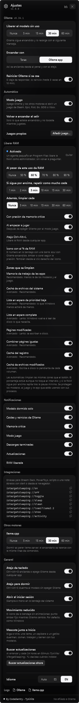

<div align="center">


# isTargetSleeping

**Vigila tus modelos locales y los pone a dormir cuando no trabajan.**

[English](README.md) · **Español**

<br>

&nbsp;&nbsp;&nbsp;&nbsp;

<sub>By <b>CodeSentry - Tykillita</b></sub>

</div>

<br>

App nativa de Windows para la bandeja del sistema que vigila tus modelos de [Ollama](https://ollama.com): cuando
dejan de trabajar los pone a dormir y te devuelve la RAM, y enciende o apaga Ollama con un clic, lo hayas instalado
como lo hayas instalado.

## ✨ Funciones

| | Función | Detalle |
|:-:|---|---|
| ⏻ | **Encender y apagar** | El botón grande del panel, o **Ctrl+Alt+O** desde cualquier app. |
| 🔍 | **Detecta tu instalación** | La app de Ollama, un servicio de Windows (NSSM, WinSW, `sc create`…), una tarea programada o un `ollama serve` a mano. Lo apaga por el mismo camino por el que arranca. |
| 🧹 | **Libera la memoria sin uso** | Tras 5, 15, 30 o 60 minutos sin generar, saca el modelo de la memoria. Ollama sigue encendido y lo recarga con el siguiente mensaje. **Ctrl+Alt+S** lo duerme al momento. |
| 🧽 | **Liberar RAM** | La limpieza de Mem Reduct integrada (memoria de trabajo, caché de archivos, listas en espera…) — con un botón, **Ctrl+Alt+L**, al pasar de X % o cada N minutos — pero sin tocar nunca los modelos ni tu juego. Puede importar y reemplazar Mem Reduct. |
| 🎮 | **Modo juego** | Abres un juego de Steam, Epic, Riot, EA, GOG, Rockstar o Xbox (o uno que añadas) y Ollama se apaga para dejarle la RAM y la VRAM; al salir vuelve a encenderse por el mismo camino. |
| 🛟 | **Vigilante** | Si Ollama se cae o se cuelga, lo reinicia con el mismo mecanismo (hasta 3 veces en 10 minutos). |
| 🔔 | **Notificaciones** | Avisos nativos de Windows cuando un modelo se duerme, Ollama se cae, la memoria llega a crítica, empieza un juego o termina una descarga; cada uno con su interruptor. |
| 📊 | **Memoria del PC y de la GPU** | RAM en uso (la misma cifra que el Administrador de tareas), **VRAM** dedicada de tu GPU, cuánto de cada una es del modelo y la presión de memoria. |
| 👀 | **Quién lo despierta** | Qué app cargó el modelo (Obsidian, Cursor, un script…), por su conexión al puerto de Ollama. |
| 📈 | **Actividad** | Esta semana: GB recuperados, siestas, horas con modelo cargado, reinicios; gráfica de 30 min y los últimos eventos. |
| 🗂️ | **Modelos** | Tamaño, cuantización y etiquetas *visión* / *herramientas*. Cárgalos, **descárgalos** (con progreso y cancelable) o **bórralos** desde el panel. |
| 🧩 | **Otros motores** | Un `llama-server` de **llama.cpp** propio tiene su tarjeta y su siesta; **LM Studio**, de forma experimental. |
| 🔗 | **Enlaces** | `istargetsleeping://on`, `off`, `toggle`, `sleep`, `load/<modelo>`… para Stream Deck, PowerToys o scripts. |
| 🎯 | **Estado de un vistazo** | La mira en la bandeja, con punto azul, ámbar o sin punto; un radar gira mientras Ollama se enciende o se apaga, y el ojo se abre con un modelo cargado. |
| 🐾 | **Mascota opcional** | **Mira**, la mascota de la app, vive en la barra de tareas (sobre Inicio, a su izquierda o de paseo) y cuenta lo que hace Ollama: duerme, come mientras carga un modelo, teclea mientras genera, barre mientras libera RAM. Tócala, acaríciala, clic derecho. Apagada por defecto; **Mascota junto a Inicio** desde el clic derecho del ícono de la bandeja o en Ajustes › General. |
| 🌍 | **Español e inglés** | Sigue el idioma de Windows, o elígelo en Ajustes. |
| 🖤 | **Vidrio negro** | Vidrio negro ahumado sobre el acrílico real de Windows 11, tarjetas translúcidas e interfaz monocroma con color solo para el estado. El ícono de la bandeja sigue el modo de la barra de tareas. |
| 🔒 | **Privado** | Solo habla con Ollama en tu PC. Sin cuentas, sin telemetría. Buscar actualizaciones es opcional y no existe si no hay un repositorio configurado. |

## 📥 Instalar

Las descargas están en [Releases](https://github.com/Tykillita/isTargetSleeping/releases).

**Portable:** descarga `isTargetSleeping-<versión>-win-x64.zip` (o `-arm64`), descomprímelo donde quieras y abre
`isTargetSleeping.exe`. Es un único `.exe` autocontenido: no hace falta instalar .NET.

**Instalador:** `isTargetSleeping-<versión>-setup-x64.exe` lo instala para tu usuario en
`%LOCALAPPDATA%\Programs\isTargetSleeping` (sin administrador).

La primera vez abre su panel junto al reloj y pregunta si abrir al iniciar sesión. Si no ves el ícono, puede estar
entre los ocultos (`^`): activa **Mostrar siempre en la barra de tareas** en Ajustes › General de la app, arrástralo a
la barra, o actívalo en *Configuración › Personalización › Barra de tareas › Otros iconos de la bandeja del sistema*.

**Requisitos:** Windows 10 (2004+) u 11 · x64 o ARM64 · [Ollama](https://ollama.com/download/windows).

## 🧭 Uso

| Acción | Resultado |
|---|---|
| **Clic** en el ícono | Abre el panel (clic fuera o Esc para cerrarlo) |
| **Arrastrar** la cabecera del panel | Lo mueve; desde entonces se abre ahí. **Doble clic** en la cabecera: vuelve junto a la bandeja |
| **Clic derecho** | Encender/apagar, dormir el modelo, actividad, ver el log de Ollama, abrir al iniciar sesión, *Acerca de*, salir |
| **Ctrl+Alt+O** | Enciende o apaga Ollama desde cualquier app |
| **Ctrl+Alt+S** | Duerme el modelo (y los de los otros motores) sin apagar nada |
| **Ctrl+Alt+L** | Libera RAM (con el agente de memoria activado) |
| **Clic en un aviso** | Abre el panel |

El panel tiene tres vistas: la principal, **Actividad** (ícono de gráfica) y **Ajustes** (engranaje); si no caben en
la pantalla, se desplazan.

**Ajustes:** *Ollama* — liberar sin uso, con qué encenderlo, reiniciarlo si se cae · *Automático* — modo juego,
volver a encender al salir, juegos propios · *Notificaciones* — un interruptor por tipo · *Integraciones* — los
enlaces, listos para copiar · *Otros motores* — la siesta de cada uno · *General* — los dos atajos, abrir al iniciar
sesión, animación de la bandeja, mascota opcional, buscar actualizaciones (solo si está configurado), idioma · logs.

**Mascota junto a Inicio:** Mira, dibujada píxel a píxel en su propia ventana en capas (nítida con cualquier
escala), junto al botón Inicio de la barra principal: sobre él, dentro de la barra a su izquierda o paseando por el
borde de la barra. Solo su silueta recibe clics (clic: el panel; clic derecho: su menú; ir y venir con el ratón: una
caricia) y nunca toma el foco; con *Interactuar con la mascota* apagado, deja pasar todos los clics. Se oculta al
instante al abrir Inicio, Buscar, un juego o una app a pantalla completa, y cuando la barra se esconde. Duerme en su camita y, mientras espera un modelo, se esconde detrás del logo de Windows y se asoma. El logo de Windows es parte de su casa: con Ollama encendido
brilla suavemente, el brillo llega panel a panel al arrancar, destella mientras Mira teclea y se llena mientras
descarga, y con Ollama apagado se queda como lo dibuja Windows (pintadas encima
del logo real por una ventana que nunca recibe clics). Si Windows
no expone el botón Inicio, permanece oculta y Ajustes explica el motivo. Apaga el interruptor para cerrarla y
detener sus temporizadores.

### Enlaces

| Enlace | Hace |
|---|---|
| `istargetsleeping://on` · `off` · `toggle` | Enciende / apaga / lo contrario |
| `istargetsleeping://sleep` | Duerme los modelos cargados |
| `istargetsleeping://clean` | Libera RAM |
| `istargetsleeping://load/llama3.2` | Carga un modelo (codifica las `/` del nombre) |
| `istargetsleeping://show` · `activity` | Abre el panel / la vista Actividad |

Se registran para tu usuario en `HKCU\Software\Classes\istargetsleeping` (sin administrador) cada vez que arranca la
app. Desde PowerShell: `start istargetsleeping://sleep`. Si la app no está abierta, el enlace la abre.

## ⚙️ Cómo funciona

- **Apagar bien:** con la app de Ollama, le pide cerrar y a los 2 s termina su árbol de procesos; la enciende con
  `ollama app.exe hidden` (solo bandeja, sin abrir la ventana de chat). Un servicio se para y arranca por el
  Administrador de control de servicios (pide UAC solo para esa orden si hace falta); una tarea programada, por el
  Programador de tareas; un `ollama serve` a mano, terminando su árbol de procesos.
- **Modelo sin uso:** cada 2,5 s suma el CPU de los runners (`llama-server.exe` en Ollama 0.34+, `ollama runner` o
  `ollama_llama_server.exe`). Medido: 0,008 s por muestra en reposo frente a decenas de segundos al generar, aunque
  el modelo esté entero en la GPU. Umbral: 0,08 s.
- **Memoria:** con GPU dedicada Ollama cuenta todo el modelo como VRAM, pero el runner reserva igualmente gigas de
  RAM; la parte «Modelo» de la barra es la memoria privada real del runner.
- **GPU:** elige por DXGI el adaptador con más memoria dedicada (la RTX de un portátil, no la gráfica integrada) y
  lee los contadores `GPU Adapter Memory` y `GPU Process Memory`, los mismos del Administrador de tareas. La VRAM de
  los runners es la parte del modelo.
- **Liberar RAM (en lugar de Mem Reduct):** las mismas zonas y los mismos bits de `ReductMask2` que Mem Reduct
  (memoria de trabajo, caché de archivos del sistema, listas en espera de prioridad baja y completa, páginas
  modificadas, combinar páginas, caché del registro y de archivos modificados; por defecto las suyas, `0xE7`). La
  diferencia: Mem Reduct vacía **toda** la memoria de trabajo de golpe; isTargetSleeping lo hace proceso a proceso y
  se salta los runners de Ollama, `llama-server`, LM Studio y el juego en curso. Medido: el runner del modelo cargado
  conservó sus ~700 MB mientras otras apps bajaban de 371 a 168 MB, y la siguiente respuesta salió a velocidad normal.
  Reglas: al pasar de X % (se rearma al bajar 5 puntos), cada N minutos, con presión crítica y al empezar a jugar;
  mínimo 3 min entre limpiezas automáticas.
- **Permisos de administrador, una vez:** *Activar* en Ajustes › Liberar RAM lanza con UAC un programa aparte y
  pequeño, `isTargetSleeping.MemoryAgent.exe` (13 MB, un solo archivo que no desempaqueta nada en `%TEMP%`). Se copia
  a `C:\Program Files\isTargetSleeping\cleaner` (solo un administrador puede escribir ahí: la tarea elevada nunca
  ejecuta algo que un proceso normal pueda cambiar) y registra la tarea `\isTargetSleeping\Liberar RAM`, sin
  disparadores y con los privilegios más altos de tu usuario. Cada limpieza lanza esa tarea con una orden compacta y
  validada estrictamente (`a=e7;k=1234,5678`: zonas y PIDs protegidos); la app mide la RAM antes y después y lee del
  código de salida qué zonas fallaron. *Quitar* (o el desinstalador) borra la tarea y la carpeta.
- **Mem Reduct:** si está instalado, Ajustes muestra su configuración (de `%APPDATA%\Henry++\Mem Reduct\memreduct.ini`).
  *Importar ajustes* copia su %, intervalo, zonas y aviso; *Reemplazar* importa, lo cierra (a través del agente,
  porque corre como administrador), lo quita del inicio y apaga su limpieza automática en su ini para que nunca
  limpien los dos a la vez; *Volver a Mem Reduct* lo deja como estaba.
- **Vigilante:** *caída* = debería estar encendido, la API no responde y no queda ningún `ollama serve` en 2 muestras
  (~5 s) → lo reinicia por el último mecanismo; *cuelgue* = el servidor vive pero la API no responde en 3 muestras
  (~7,5 s) → lo mata y lo reinicia. Máximo 3 veces en 10 min; luego se rinde y avisa. No actúa si lo apagaste tú, si
  saliste de la app de Ollama desde su menú ni en modo juego. Medido: un `ollama serve` matado vuelve en ~8–10 s.
- **Modo juego:** cada 2,5 s busca un proceso **con ventana visible** cuyo `.exe` esté en una biblioteca: Steam
  (todas las de `libraryfolders.vdf`), Epic (sus manifiestos `.item`), `C:\Riot Games`, EA Games, Rockstar Games,
  GOG (su registro), `XboxGames` en cualquier disco y tus juegos propios; también cuenta la pantalla completa
  exclusiva de Direct3D. Lanzadores, ayudantes, antitrampas y Wallpaper Engine no cuentan. Entra a los **5 s** de
  abrir el juego y sale **30 s** después de cerrarlo; al entrar apaga lo que estaba encendido y al salir enciende
  solo eso. Si lo enciendes a mano mientras juegas, se respeta. El panel ofrece **Encender igualmente** y **No es un
  juego** (ignora ese `.exe` en adelante).
- **Quién lo despierta:** cada segundo lee la tabla TCP de Windows (`GetExtendedTcpTable`, con el proceso dueño) y
  anota qué procesos están conectados al puerto de Ollama; cuando aparece un modelo en memoria, se atribuye a las
  apps vistas en los últimos 10 s.
- **Otros motores:** **llama.cpp** (probado): cualquier `llama-server.exe` que no haya lanzado Ollama (los runners de
  Ollama se reconocen por su proceso padre o, si ya no existe, por sus opciones `--no-webui --offline`). Como no
  descarga el modelo sin cerrarse, «dormir» para el proceso y recuerda su línea de comandos exacta para relanzarlo
  igual. **LM Studio** (**experimental, sin probar**): solo si `lms.exe` está instalado; puerto 1234,
  `/api/v0/models`, `lms server start|stop` y `lms unload --all`.
- **Actualizaciones:** repositorio público oficial **Tykillita/isTargetSleeping** configurado por defecto.
  La búsqueda automática comienza activada, al arrancar y cada 24 horas; puedes apagarla en Ajustes. Conserva las
  preferencias explícitas existentes, incluido `updateCheck: false` y un `updateRepo` personalizado.
  **Buscar actualizaciones ahora** en Ajustes y en el menú de la bandeja funciona aunque la búsqueda automática
  esté apagada. Respeta los tiempos de espera de GitHub y diferencia errores, paquetes incompatibles y ausencia
  de versiones publicadas.
- Solo ofrece versiones estables superiores y el paquete correspondiente al proceso x64/ARM64. Muestra versión
  actual, nueva y **Ver novedades**. Al pulsar **Actualizar**, descarga con progreso y cancelación, comprueba
  SHA-256, rutas del ZIP y versión/arquitectura del ejecutable. Un auxiliar espera el cierre normal, reemplaza el
  archivo en su ubicación actual y conserva un respaldo hasta que arranca la nueva bandeja. Si falla, restaura
  y abre la versión anterior. Conserva ajustes e historial; si no puedes escribir en la carpeta, ofrece descarga
  manual. El agente de memoria se actualiza por separado, con su permiso de administrador.
- Las instalaciones anteriores a 1.3.0 sin repositorio configurado necesitan una primera actualización manual.

## 🔒 Privacidad

- Se conecta a la API local de Ollama (`127.0.0.1:11434` u `OLLAMA_HOST`) y a los puertos locales de los otros motores.
- La búsqueda automática de actualizaciones (activada inicialmente y opcional en Ajustes) consulta `api.github.com`
  al arrancar y cada 24 horas, sin credenciales. Al pulsar **Actualizar**, descarga el paquete y su comprobante
  desde GitHub y sus servidores `release-assets.githubusercontent.com`/`objects.githubusercontent.com`. GitHub
  recibe tu IP y el identificador de la app; no se envían modelos, conversaciones, ajustes ni historial de uso.
  No hay cuentas, telemetría ni analítica. Las páginas de novedades, descargas y créditos se abren al pulsar sus enlaces.
- Los permisos de administrador solo los usa el agente de memoria, solo para liberar RAM (y cerrar Mem Reduct si lo
  reemplazas), y solo si lo activas.
- Ajustes en `%LOCALAPPDATA%\isTargetSleeping\settings.json`, historial de 90 días en `stats.json` y su propio
  registro en `Logs\app.log` (avisos, reinicios, modo juego). Los enlaces viven en
  `HKCU\Software\Classes\istargetsleeping`; el instalador lo borra al desinstalar.

## 🛠️ Desarrollo

Windows 100 % nativo: C# sobre .NET 10 con **WPF** para la interfaz y **Win32** directo para todo lo demás (DXGI y
PDH para la GPU, `GetExtendedTcpTable`, `WM_COPYDATA` entre instancias…). Sin paquetes NuGet, sin WinForms, sin web
views.

```powershell
.\build.ps1                    # build\isTargetSleeping.exe (autocontenido, un solo archivo)
.\build.ps1 -Install           # además lo instala y lo relanza
.\build.ps1 -Test              # pruebas: IdleTracker, vigilante, modo juego, bibliotecas, estadísticas, descargas, enlaces y actualizador
.\package.ps1                  # dist\: zip + instalador para x64 y arm64
.\package.ps1 -RequireInstaller # falla si falta Inno Setup
.\docs\generate-images.ps1     # imágenes del README y assets del logo
```

### Preparar una versión en GitHub

Actualiza `VERSION` con `MAJOR.MINOR.PATCH` y añade su sección `## [versión]` al changelog. Ejecuta
`.\build.ps1 -Test`, `.\package.ps1 -RequireInstaller` y
`.\packaging\verify-release.ps1 -Tag v<versión> -VerifyAssets`. Guarda los cambios y sube la etiqueta correspondiente.
El proceso `prepare-release` repite las comprobaciones y pruebas, prepara Inno Setup 6, genera los ZIP e instaladores
de ambas arquitecturas y verifica los ocho archivos con sus hashes. Después crea un **borrador** con las notas
del changelog para que lo revises y publiques desde GitHub. La app no ve borradores ni versiones preliminares.
Se mantienen las comprobaciones de `main` y las solicitudes de cambios. Solo el trabajo que crea el borrador tiene
permiso de escritura; la app no requiere un token. La firma opcional conserva `SIGN_CERT_THUMBPRINT`; se admiten
versiones sin firmar.

## Créditos

**By CodeSentry - Tykillita.** CodeSentry es la empresa de desarrollo de software y ciberseguridad de Ruben Pino
(Tykillita).

isTargetSleeping se basa en la **idea** de [ModelNap](https://github.com/eriktaveras/modelnap), de Erik Taveras
(Taveras Solutions LLC, licencia MIT): una app pequeña que pone a dormir los modelos de Ollama sin uso.
isTargetSleeping está **rediseñado por completo** —una app nativa de Windows con identidad propia e interfaz de vidrio
negro— y tiene **funciones nuevas y originales** como el modo juego, vigilante de Ollama, liberar RAM
protegiendo los modelos (en lugar de Mem Reduct), uso de GPU/VRAM, «quién despierta al modelo», la vista Actividad con
su historial, descargar y borrar modelos, llama.cpp y LM Studio, enlaces `istargetsleeping://`, notificaciones y
actualizaciones. El aviso de copyright de ModelNap se conserva en [LICENSE](LICENSE), como exige su licencia MIT.

Ollama es una marca de sus respectivos dueños; este proyecto no está afiliado a Ollama.
