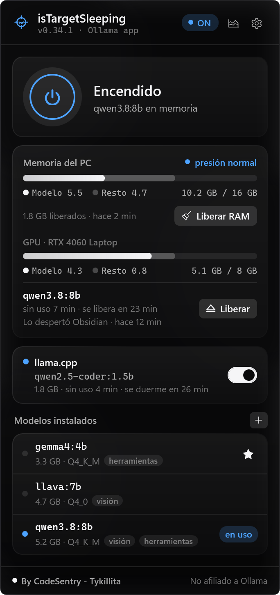
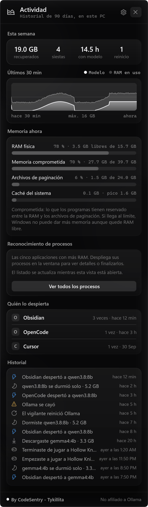
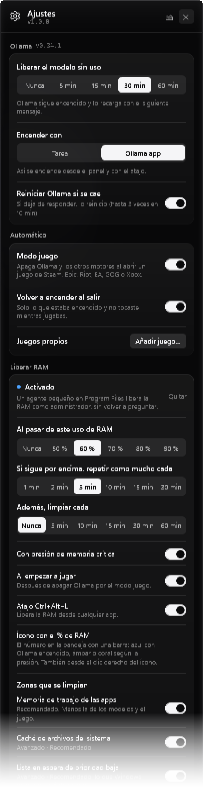
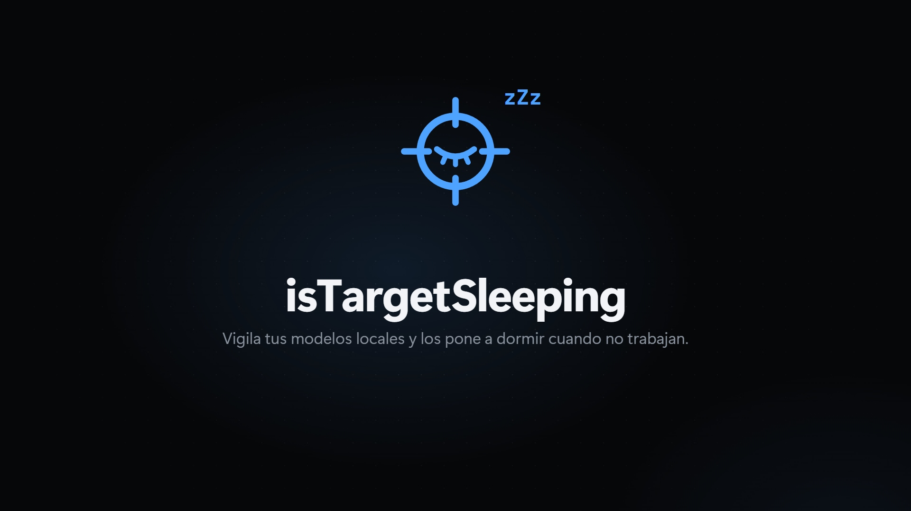
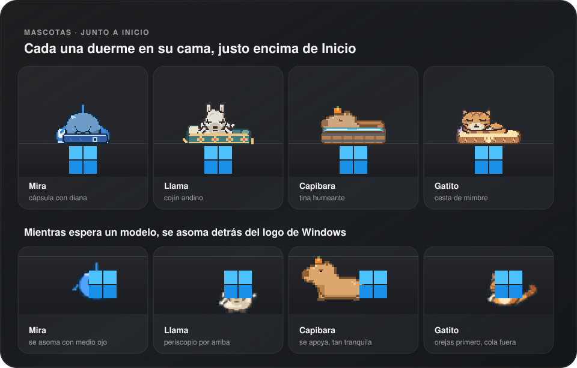
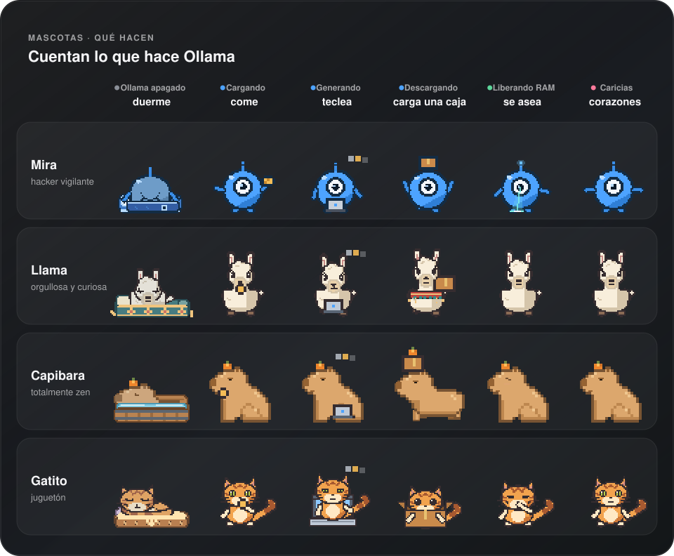
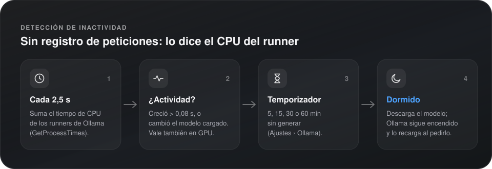
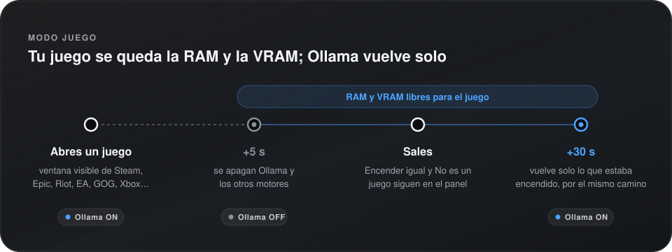

<div align="center">


# isTargetSleeping

**Vigila tus modelos locales y los pone a dormir cuando no trabajan.**

[English](README.md) · **Español**

<!-- La placa de versión repite VERSION: actualiza las dos a la vez. -->
[](CHANGELOG.md)


[](LICENSE)

<br>

&nbsp;&nbsp;&nbsp;&nbsp;<a href="docs/images/settings-es.png"></a>

<p>
  <a href="#video">Video</a> &bull;
  <a href="#-funciones">Funciones</a> &bull;
  <a href="#-mascotas">Mascotas</a> &bull;
  <a href="#-instalar">Instalar</a> &bull;
  <a href="#-uso">Uso</a> &bull;
  <a href="#como-funciona">Cómo funciona</a> &bull;
  <a href="#-privacidad">Privacidad</a> &bull;
  <a href="#desarrollo">Desarrollo</a> &bull;
  <a href="CONTRIBUTING.md#es">Contribuir</a> &bull;
  <a href="SECURITY.md#es">Política de seguridad</a>
</p>

<sub>By <b>CodeSentry - Tykillita</b></sub>

</div>

<br>

App nativa de Windows para la bandeja del sistema que vigila tus modelos de [Ollama](https://ollama.com): cuando
dejan de trabajar los pone a dormir y te devuelve la RAM, y enciende o apaga Ollama con un clic, lo hayas instalado
como lo hayas instalado.

<a id="video"></a>

[](https://istargetsleeping.web.app/?lang=es#video)

<p align="center"><sub>La app actual 1.5.2 en 77 segundos, con sonido y datos de ejemplo · <a href="https://istargetsleeping.web.app/?lang=es#video">ver en la web</a> · <a href="https://istargetsleeping.web.app/?lang=en#video">in English</a> · <a href="docs/video/isTargetSleeping-tour-es.mp4">descargar el MP4</a></sub></p>

## ✨ Funciones

| | Función | Detalle |
|:-:|---|---|
| ⏻ | **Encender y apagar** | El botón grande del panel, o **Ctrl+Alt+O** desde cualquier app. |
| 🔍 | **Detecta tu instalación** | La app de Ollama, un servicio de Windows (NSSM, WinSW, `sc create`…), una tarea programada o un `ollama serve` a mano. Lo apaga por el mismo camino por el que arranca. |
| 🧹 | **Libera la memoria sin uso** | Tras 5, 15, 30 o 60 minutos sin generar, saca el modelo de la memoria. Ollama sigue encendido y lo recarga con el siguiente mensaje. **Ctrl+Alt+S** lo duerme al momento. |
| 🧽 | **Liberar RAM** | Limpieza automática al pasar de tu porcentaje (repite tras una pausa mínima mientras siga alta), cada cierto tiempo o con presión crítica; también con el botón o **Ctrl+Alt+L**. Protege modelos, juegos y la app que estás usando. No necesita Mem Reduct. |
| 🔎 | **Reconocimiento de procesos** | Actividad muestra las cinco aplicaciones que más RAM usan. Abre la ventana completa (su botón ✕ o Esc la cierran y vuelven al panel) para ver RAM/CPU, desplegar PIDs, buscar y filtrar, o finalizar una aplicación, proceso o árbol tras confirmar. |
| 🎮 | **Modo juego** | Abres un juego de Steam, Epic, Riot, EA, GOG, Rockstar o Xbox (o uno que añadas) y Ollama se apaga para dejarle la RAM y la VRAM; al salir vuelve a encenderse por el mismo camino. |
| 🛟 | **Vigilante** | Si Ollama se cae o se cuelga, lo reinicia con el mismo mecanismo (hasta 3 veces en 10 minutos). |
| 🔔 | **Notificaciones** | Avisos nativos de Windows cuando un modelo se duerme, Ollama se cae, la memoria llega a crítica, empieza un juego o termina una descarga; cada uno con su interruptor. |
| 📊 | **Memoria del PC y de la GPU** | RAM en uso (la misma cifra que el Administrador de tareas), **VRAM** dedicada de tu GPU, cuánto de cada una es del modelo y la presión de memoria. |
| 👀 | **Quién lo despierta** | Qué app cargó el modelo (Obsidian, Cursor, un script…), por su conexión al puerto de Ollama. |
| 📈 | **Actividad** | Esta semana: GB recuperados, siestas, horas con modelo cargado, reinicios; gráfica de 30 min, **memoria ahora** (RAM física, memoria comprometida, archivos de paginación y caché del sistema, como Mem Reduct) y los últimos eventos. |
| 🗂️ | **Modelos** | Tamaño, cuantización y etiquetas *visión* / *herramientas*. Cárgalos, **descárgalos** (con progreso y cancelable) o **bórralos** desde el panel. |
| 🧩 | **Otros motores** | Un `llama-server` de **llama.cpp** propio tiene su tarjeta y su siesta; **LM Studio**, de forma experimental. |
| 🔗 | **Enlaces** | `istargetsleeping://on`, `off`, `toggle`, `sleep`, `load/<modelo>`… para Stream Deck, PowerToys o scripts. |
| 🎯 | **Estado de un vistazo** | La mira en la bandeja, con punto azul, ámbar o sin punto; un radar gira mientras Ollama se enciende o se apaga, y el ojo se abre con un modelo cargado. |
| 🐾 | **Mascotas con personalidad** | Elige a **Mira**, una **llama**, una **capibara** o un **gatito naranja**. Una vive en la barra de tareas (sobre Inicio, a su izquierda o de paseo) y cuenta lo que hace Ollama: duerme en su cama, come mientras carga un modelo, teclea mientras genera y se asea a su manera mientras libera RAM. Cada una reacciona a tus clics y a tu cursor a su manera — dormida, sin salir de la cama. Apagadas por defecto; [más abajo](#-mascotas). |
| 🌍 | **Español e inglés** | Sigue el idioma de Windows, o elígelo en Ajustes. |
| 🖤 | **Vidrio negro** | Vidrio negro ahumado sobre el acrílico real de Windows 11, tarjetas translúcidas e interfaz monocroma con color solo para el estado. El ícono de la bandeja sigue el modo de la barra de tareas. |
| 🔄 | **Actualizaciones** | Busca versiones estables nuevas en GitHub, muestra las notas y solo instala cuando pulsas **Actualizar** — verificada con SHA-256 y con vuelta atrás automática si algo falla. |
| 🔒 | **Privado** | Habla con tus motores de modelos locales. Sin cuentas, telemetría ni analítica. La búsqueda opcional de actualizaciones y sus descargas contactan con GitHub; los datos de procesos se quedan en tu PC. |

## 📥 Instalar

**1.5.0 ya está publicada** (2 de octubre de 2026): memoria ahora en Actividad, reglas de limpieza
automática completas y mascotas renovadas.

**1.5.2 ya está publicada** (3 de octubre de 2026): encendido y apagado de servicio y tarea verificados con
Ollama real en Windows, portada blanca provisional, capturas actuales y recorridos bilingües.
[Validación y límites](docs/backend-validation-1.5.2.md#es).

Las descargas están en [Releases](https://github.com/Tykillita/isTargetSleeping/releases).

**Portable:** descarga `isTargetSleeping-<versión>-win-x64.zip` (o `-arm64`), descomprímelo donde quieras y abre
`isTargetSleeping.exe`. Es un único `.exe` autocontenido: no hace falta instalar .NET.

**Instalador:** `isTargetSleeping-<versión>-setup-x64.exe` lo instala para tu usuario en
`%LOCALAPPDATA%\Programs\isTargetSleeping` (sin administrador).

La primera vez abre su panel junto al reloj y pregunta si abrir al iniciar sesión. Si no ves el ícono, puede estar
entre los ocultos (`^`): activa **Mostrar siempre en la barra de tareas** en Ajustes › General de la app, arrástralo a
la barra, o actívalo en *Configuración › Personalización › Barra de tareas › Otros iconos de la bandeja del sistema*.
Si el interruptor no aparece (Windows 10, o Windows 11 antes de registrar el ícono), Ajustes › General trae un botón
que abre los ajustes de la barra de tareas.

**Requisitos:** Windows 10 (2004+) u 11 · x64 o ARM64 · [Ollama](https://ollama.com/download/windows).

## 🧭 Uso

| Acción | Resultado |
|---|---|
| **Clic** en el ícono | Abre el panel (clic fuera o Esc para cerrarlo) |
| **Arrastrar** la cabecera del panel | Lo mueve; desde entonces se abre ahí. **Doble clic** en la cabecera: vuelve junto a la bandeja |
| **Clic derecho** | Encender/apagar, dormir el modelo, actividad, ver el log de Ollama, abrir al iniciar sesión, *Acerca de*, salir |
| **Ctrl+Alt+O** | Enciende o apaga Ollama desde cualquier app |
| **Ctrl+Alt+S** | Duerme el modelo (y los de los otros motores) sin apagar nada |
| **Ctrl+Alt+L** | Libera RAM (con el agente de memoria activado) |
| **Clic en un aviso** | Abre el panel |

El panel tiene tres vistas: la principal, **Actividad** (ícono de gráfica) y **Ajustes** (engranaje); si no caben en
la pantalla, se desplazan.

**Ajustes:** *Ollama* — liberar sin uso, con qué encenderlo, reiniciarlo si se cae · *Automático* — modo juego,
volver a encender al salir, juegos propios · *Notificaciones* — un interruptor por tipo · *Integraciones* — los
enlaces, listos para copiar · *Otros motores* — la siesta de cada uno · *General* — los dos atajos, abrir al iniciar
sesión, mostrar siempre en la barra, animación de la bandeja, mascota, buscar actualizaciones, idioma · logs.

### 🐾 Mascotas

<p align="center"></p>

Activa **Mascota junto a Inicio** en Ajustes › General (o en el menú de la bandeja) y una mascota se muda a tu barra
de tareas. Está dibujada píxel a píxel en su propia ventana en capas, nítida con cualquier escala, y vive en uno de
tres sitios: **sobre Inicio**, **dentro de la barra a la izquierda de Inicio** (tocando el logo de Windows) o
**paseando** por la barra hasta la bandeja mientras hay un modelo despierto. Elígela en el selector de dos columnas de
Ajustes o en su menú de clic derecho; se guarda y cambia sin reiniciar.

**Cuenta lo que hace Ollama:**

<p align="center"></p>

<details>
<summary>Ver como tabla</summary>

| Ollama | La mascota |
|---|---|
| Apagado | Duerme en su cama, con Z |
| Arrancando · apagándose | Se estira y despierta · bosteza y vuelve a la cama |
| Encendido, sin modelo | Dormita — o se esconde detrás del logo de Windows y se asoma |
| Cargando un modelo | Come algo |
| Modelo en memoria | Atenta, con sus propios gestos |
| Generando | Teclea en un portátil diminuto |
| Descargando un modelo | Carga una caja |
| Liberando RAM | Limpia a su manera (ver abajo); si dormía, primero sale de la cama y después vuelve |
| Presión de memoria alta · crítica | Suda · se pone coral |

</details>

Reacciones puntuales: destellos al liberar RAM, una siesta cuando el modelo se duerme, estrellitas de mareo cuando
Ollama se cae (triste si el vigilante se rinde), un salto al hacerle clic y corazones al acariciarla (ir y venir con
el ratón por encima). Los destellos cierran la limpieza: llegan cuando ya se la ha visto limpiar, allí donde esté.
**Dormida, reacciona sin salir de la cama** — entreabre un ojo, mueve una oreja, una burbuja, un resoplido o un
ronroneo — y el logo de Windows se queda apagado.

**Cada una tiene su carácter:**

| Mascota | Carácter | Lo suyo | Cama |
|---|---|---|---|
| **Mira** | Hacker vigilante — el logo de la app hecho personaje | Lanza un anillo de radar desde el ojo, fija una retícula roja sobre tu cursor, su antena emite señales y suben bits mientras trabaja; el clic es un *ping* de radar; es un robot: arranca calibrando el ojo y limpia escaneando la barra con un haz del ojo, atrae los datos sueltos y los compacta en un cubo que estalla en destellos | Cápsula azul con diana |
| **Llama** | Orgullosa, curiosa y algo dramática | Sin brazos: se expresa con el cuello, las orejas, las pezuñas y su cola lanuda. Trota con la cabeza alta, rumia de lado con la comida en el hocico, teclea picoteando el portátil al ritmo de sus pezuñas, tararea, estira el cuello hacia el cursor, lleva la caja bajo una manta tejida y resopla una nubecita al clic; para limpiar se sacude el polvo de la lana; se asoma sobre el logo como un periscopio | Cojín de tejido andino |
| **Capibara** | Zen | Casi ni se inmuta (un parpadeo lento y una burbuja), un pájaro se le posa en el lomo, equilibra la caja en la cabeza con la mandarina encima; sin nada que hacer está sentada; mientras Ollama arranca llega su cocodrilo, se sube de un salto (de pie), se sienta en su lomo para pasear y ya encendido se baja (el paseo siempre termina); para limpiar se frota el trasero por el suelo y acaba brillante (si dormía, sale de su tina y se escurre el pelo); no se esconde — se apoya en el logo | Tina de madera humeante |
| **Gatito naranja** | Juguetón | Se agacha con las pupilas dilatadas al pasar el ratón, salta sobre el cursor si se queda quieto 1,2 s, se eriza y da un zarpazo al clic, se acicala, amasa ronroneando; un gato no barre: se lava a lametones; al asomarse enseña primero las orejas y deja la cola fuera | Cesta de mimbre acolchada |

**El logo de Windows participa** como parte de su casa: una segunda ventana que no recibe clics pinta «luces» sobre el
logo real, panel a panel. Con Ollama apagado se queda exactamente como lo dibuja Windows; con Ollama encendido brilla
suavemente, el brillo llega panel a panel al arrancar, un panel destella con cada tecla mientras el modelo genera, los
paneles se llenan como una barra de progreso al descargar y brilla en ámbar mientras carga un modelo. Los clics siguen
yendo a Inicio.

**No estorba.** Solo su silueta recibe clics (clic: el panel; clic derecho: su menú) y nunca toma el foco; con
*Interactuar con la mascota* apagado deja pasar todos los clics. Se oculta al instante al abrir Inicio, Buscar, un
juego o una app a pantalla completa, y con la barra que se oculta sola. Si Windows no expone el botón Inicio,
permanece oculta y Ajustes explica el motivo. **Movimiento reducido** usa una postura fija por estado y especie, sin
temporizadores. Al apagar el interruptor se cierra su ventana y se detienen sus temporizadores.

Para revisar sus animaciones sin cambiar tus ajustes, `--export-pet carpeta` genera hojas de las cuatro especies con
fondos claros y oscuros: cada estado, transición (también limpiar desde la cama y despierta), gesto (con sus
partículas), reacción al ratón, cada reacción de pie y en la cama, el final de una limpieza, paseo en ambos sentidos,
movimiento reducido y una vista conjunta con las camas. `--snapshot salida.png pet --pet llama` genera una
vista individual; los identificadores son `mira`, `llama`, `capybara` y `orange-cat`.

### Enlaces

| Enlace | Hace |
|---|---|
| `istargetsleeping://on` · `off` · `toggle` | Enciende / apaga / lo contrario |
| `istargetsleeping://sleep` | Duerme los modelos cargados |
| `istargetsleeping://clean` | Libera RAM |
| `istargetsleeping://load/llama3.2` | Carga un modelo (codifica las `/` del nombre) |
| `istargetsleeping://show` · `activity` | Abre el panel / la vista Actividad |

Se registran para tu usuario en `HKCU\Software\Classes\istargetsleeping` (sin administrador) cada vez que arranca la
app. Desde PowerShell: `start istargetsleeping://sleep`. Si la app no está abierta, el enlace la abre.

<a id="como-funciona"></a>

## ⚙️ Cómo funciona

### Apagar Ollama por su mecanismo de arranque

| Si Ollama viene de… | Apagar | Encender | Verificado |
|---|---|---|:-:|
| **App de Ollama** (instalador de ollama.com) | Pide cerrar sus ventanas, termina su árbol tras 2 s y cualquier `ollama serve` restante | `ollama app.exe hidden` (solo bandeja, sin ventana de chat; el mismo indicador del inicio de sesión) | ✅ 0.34.1 / 0.34.4 / 0.35.0 |
| **Servicio de Windows** que ejecuta Ollama | Detener por el Administrador de control de servicios | Iniciar por SCM | ✅ VM Windows Server 2025 x64 · Ollama 0.35.1 |
| **Tarea programada** que ejecuta `ollama serve` | `Stop` del Programador de tareas | `Run` del Programador de tareas | ✅ VM Windows Server 2025 x64 · Ollama 0.35.1 |
| **`ollama serve` manual** | Termina el árbol del servidor | Lo lanza desacoplado, con log en `%LOCALAPPDATA%\isTargetSleeping\Logs\ollama.log` | ✅ |
| **Sin instalar** | — | Abre ollama.com/download | ✅ |

La verificación de servicio y tarea usa el ejecutable real 1.5.2 y Ollama real: dos ciclos completos,
estado de la API, identidades de procesos, órdenes repetidas y limpieza del entorno de prueba. El servicio
usa un host nativo SCM bajo LocalService y la tarea funciona bajo SYSTEM. No se cargaron modelos. Cubre esas
configuraciones en una VM Windows; GPU físicas, todos los wrappers de terceros y UAC interactivo quedan fuera
de su alcance. Consulta el [informe bilingüe](docs/backend-validation-1.5.2.md) y las
[pruebas reproducibles](tests/BackendIntegration/README.md).

Un servicio suele necesitar permisos de administrador: la app funciona como usuario normal y pide UAC
solo para esa orden `sc start/stop`. Al detenerlo por SCM, no se dispara su política de reinicio por fallo.
La detección busca app activa → servicio activo → tarea activa → `ollama serve` manual → lo instalado.
Con Ollama apagado, usa lo elegido en Ajustes o el último mecanismo recordado entre sesiones.

### Modelos, memoria y limpieza

<p align="center"></p>

- **Modelo sin uso:** cada 2,5 s suma el CPU de los runners (`llama-server.exe` en Ollama 0.34+, `ollama runner` o
  `ollama_llama_server.exe`). Medido: 0,008 s por muestra en reposo frente a decenas de segundos al generar, aunque
  el modelo esté entero en la GPU. Umbral: 0,08 s.
- **Memoria:** con GPU dedicada Ollama cuenta todo el modelo como VRAM, pero el runner reserva igualmente gigas de
  RAM; la parte «Modelo» de la barra es la memoria privada real del runner.
- **GPU:** elige por DXGI el adaptador con más memoria dedicada (la RTX de un portátil, no la gráfica integrada) y
  lee los contadores `GPU Adapter Memory` y `GPU Process Memory`, los mismos del Administrador de tareas. La VRAM de
  los runners es la parte del modelo.
- **Limpieza automática:** limpia las mismas zonas que el botón, con reglas independientes.
  - **Porcentaje:** al llegar al % elegido (por ejemplo 70 %) limpia enseguida, aunque no toque el intervalo; si la
    RAM sigue por encima, repite como mucho cada *pausa mínima* (de 1 a 30 min; 5 por defecto).
  - **Intervalo:** cada N minutos desde la última limpieza, sea del tipo que sea, con la RAM que haya.
  - **Presión crítica:** actúa en cuanto Windows la avisa y, si sigue, repite tras la pausa mínima.
  - **Al empezar a jugar:** cuando Ollama y los otros motores confirman que se apagaron (hasta treinta segundos).

  Ninguna espera a que Windows marque presión alta: manda tu porcentaje. Hay al menos un minuto entre dos intentos y
  un intento fallido se reintenta a los 3, 6, 15 y luego cada 30 minutos. Protege modelos, motores, el juego y la app
  que estás usando con sus procesos; con la barra de tareas, la bandeja o el escritorio delante solo se protege el
  Explorador, no todo lo abierto desde Inicio. Los procesos protegidos de Windows que niegan el acceso se saltan.
- **Zonas (en lugar de Mem Reduct):** conserva las zonas configuradas y los mismos bits de `ReductMask2`
  (por defecto `0xE7`): memoria de trabajo, cachés, listas en espera, páginas modificadas y combinación de páginas.
  Las operaciones globales de caché y escritura de volúmenes aparecen como opciones avanzadas. El resultado
  distingue éxito, parcial, fallo y sin trabajo, con mediciones antes, al terminar y a los cinco y treinta segundos.
  El cambio observado puede ser negativo e incluir otras actividades del PC; no garantiza ahorro sostenido. El
  agregado semanal usa la observación a los cinco segundos. La memoria en espera ya está disponible para Windows.

  | Zona | API | Por defecto |
  |---|---|:-:|
  | Memoria de trabajo de aplicaciones | `EmptyWorkingSet` por proceso, excluyendo protegidos y descendientes | ✅ |
  | Caché de archivos del sistema | `NtSetSystemInformation(SystemFileCacheInformationEx)` | ✅ |
  | Lista en espera de prioridad baja | `SystemMemoryListInformation` → `MemoryPurgeLowPriorityStandbyList` | ✅ |
  | Toda la lista en espera | → `MemoryPurgeStandbyList` (Windows vuelve a leerla del disco) | ⬜ |
  | Lista de páginas modificadas | → `MemoryFlushModifiedList` | ⬜ |
  | Combinar páginas idénticas | `SystemCombinePhysicalMemoryInformation` (Windows 10+) | ✅ |
  | Caché del registro | `SystemRegistryReconciliationInformation` (Windows 8.1+) | ✅ |
  | Caché de archivos modificados | `FlushFileBuffers` en cada volumen fijo | ✅ |

- **Permisos de administrador para limpieza, una vez:** *Activar* en Ajustes › Liberar RAM lanza con UAC el programa
  aparte `isTargetSleeping.MemoryAgent.exe`. Se copia
  a `C:\Program Files\isTargetSleeping\cleaner` (solo un administrador puede escribir ahí: la tarea elevada nunca
  ejecuta algo que un proceso normal pueda cambiar) y registra la tarea `\isTargetSleeping\Liberar RAM`, sin
  disparadores y con los privilegios más altos de tu usuario. Cada limpieza tiene una solicitud validada, su
  identificador y las identidades protegidas; el agente escribe su informe atómicamente en su carpeta protegida.
  Las solicitudes del panel, atajo y CLI se serializan; si el agente sigue activo, permanece pendiente e impide
  otra limpieza. *Quitar* (o el desinstalador) borra la tarea y la carpeta. Actualiza el agente anterior desde
  Ajustes para usar las nuevas operaciones.
- **Reconocimiento de procesos:** Actividad muestra las cinco aplicaciones que más RAM usan. **Ver todos los
  procesos** abre una ventana con RAM, porcentaje de RAM física, CPU, usuario y estado, agrupada por ruta del
  ejecutable, propietario y sesión. Despliega los PIDs para ver ruta, padre y memoria comprometida. Busca por
  nombre, ejecutable, ruta o PID; filtra por tipo y RAM mínima; ordena por RAM, CPU, nombre, cantidad o PID.
  Usa RAM privada residente donde Windows la admite y etiqueta el fallback como RAM residente total. Los datos
  inaccesibles quedan «No disponible» y las sumas pueden diferir de la RAM global.
- La ventana actualiza cada dos segundos mientras está visible; al minimizar o cerrar deja de muestrear.
  **Pausar** y **Actualizar** permiten controlarlo. Guarda tamaño, posición y ordenación; búsqueda y filtros son
  temporales. La consulta y finalización normal funcionan sin instalar el agente.
- **Finalizar procesos:** **Finalizar aplicación** incluye sus procesos agrupados y descendientes; **Finalizar
  proceso**, solo el PID elegido; **Finalizar árbol**, también sus descendientes. Siempre pide confirmación con
  alcance, PIDs y memoria. El cierre es forzado y puede perder trabajo sin guardar. Bloquea procesos críticos de
  Windows y los propios; revalida PID y hora de creación y comprueba cada salida. Ante acceso denegado ofrece
  **Reintentar como administrador**, con UAC propio y una orden separada del agente. La tarea de limpieza no admite
  estas órdenes. Un servidor gestionado finalizado queda apagado manualmente; si un servicio externo lo reinicia,
  aparece como reaparecido, sin desactivar servicios ni tareas de inicio.
- **Mem Reduct no hace falta:** isTargetSleeping limpia con su propio agente. Si aún lo tienes, desinstálalo o apaga
  su limpieza automática para que no limpien los dos a la vez.
- **Vigilante:** *caída* = debería estar encendido, la API no responde y no queda ningún `ollama serve` en 2 muestras
  (~5 s) → lo reinicia por el último mecanismo; *cuelgue* = el servidor vive pero la API no responde en 3 muestras
  (~7,5 s) → lo mata y lo reinicia. Máximo 3 veces en 10 min; luego se rinde y avisa. No actúa si lo apagaste tú, si
  saliste de la app de Ollama desde su menú ni en modo juego. Medido: un `ollama serve` matado vuelve en ~8–10 s.
<p align="center"></p>

- **Modo juego:** cada 2,5 s busca un proceso **con ventana visible** cuyo `.exe` esté en una biblioteca: Steam
  (todas las de `libraryfolders.vdf`), Epic (sus manifiestos `.item`), `C:\Riot Games`, EA Games, Rockstar Games,
  GOG (su registro), `XboxGames` en cualquier disco y tus juegos propios; también cuenta la pantalla completa
  exclusiva de Direct3D. Lanzadores, ayudantes, antitrampas y Wallpaper Engine no cuentan. Entra a los **5 s** de
  abrir el juego y sale **30 s** después de cerrarlo; al entrar apaga lo que estaba encendido y al salir enciende
  solo eso. Si lo enciendes a mano mientras juegas, se respeta. El panel ofrece **Encender igualmente** y **No es un
  juego** (ignora ese `.exe` en adelante).
- **Quién lo despierta:** cada segundo lee la tabla TCP de Windows (`GetExtendedTcpTable`, con el proceso dueño) y
  anota qué procesos están conectados al puerto de Ollama; cuando aparece un modelo en memoria, se atribuye a las
  apps vistas en los últimos 10 s.
- **Otros motores:** **llama.cpp** (probado): cualquier `llama-server.exe` que no haya lanzado Ollama (los runners de
  Ollama se reconocen por su proceso padre o, si ya no existe, por sus opciones `--no-webui --offline`). Como no
  descarga el modelo sin cerrarse, «dormir» para el proceso y recuerda su línea de comandos exacta para relanzarlo
  igual. **LM Studio** (**experimental, sin probar**): solo si `lms.exe` está instalado; puerto 1234,
  `/api/v0/models`, `lms server start|stop` y `lms unload --all`.
- **Actualizaciones:** repositorio público oficial **Tykillita/isTargetSleeping** configurado por defecto.
  La búsqueda automática comienza activada, al arrancar y cada 24 horas; puedes apagarla en Ajustes. Conserva las
  preferencias explícitas existentes, incluido `updateCheck: false` y un `updateRepo` personalizado.
  **Buscar actualizaciones ahora** en Ajustes y en el menú de la bandeja funciona aunque la búsqueda automática
  esté apagada. Respeta los tiempos de espera de GitHub y diferencia errores, paquetes incompatibles y ausencia
  de versiones publicadas.
- Solo ofrece versiones estables superiores y el paquete correspondiente al proceso x64/ARM64. Muestra versión
  actual, nueva y **Ver novedades**. Al pulsar **Actualizar**, descarga con progreso y cancelación, comprueba
  SHA-256, rutas del ZIP y versión/arquitectura del ejecutable. Un auxiliar espera el cierre normal, reemplaza el
  archivo en su ubicación actual y conserva un respaldo hasta que arranca la nueva bandeja. Si falla, restaura
  y abre la versión anterior. Conserva ajustes e historial; si no puedes escribir en la carpeta, ofrece descarga
  manual. El agente de memoria se actualiza por separado, con su permiso de administrador.
- Las instalaciones anteriores a 1.3.0 sin repositorio configurado necesitan una primera actualización manual.

### Memoria ahora

Actividad separa RAM física, memoria comprometida, archivos de paginación y caché del sistema (actual y pico),
con una barra para cada medida. La memoria comprometida es lo que los programas han reservado entre RAM y
archivos de paginación; llegar a su límite puede impedir nuevas reservas aunque quede RAM física disponible.

## 🔒 Privacidad

- Se conecta a la API local de Ollama (`127.0.0.1:11434` u `OLLAMA_HOST`) y a los puertos locales de los otros motores.
- La búsqueda automática de actualizaciones (activada inicialmente y opcional en Ajustes) consulta `api.github.com`
  al arrancar y cada 24 horas, sin credenciales. Al pulsar **Actualizar**, descarga el paquete y su comprobante
  desde GitHub y sus servidores `release-assets.githubusercontent.com`/`objects.githubusercontent.com`. GitHub
  recibe tu IP y el identificador de la app; no se envían modelos, conversaciones, ajustes ni historial de uso.
  No hay cuentas, telemetría ni analítica. Las páginas de novedades, descargas y créditos se abren al pulsar sus enlaces.
- El agente usa permisos de administrador para la limpieza activada y los reintentos de
  finalización confirmados. Cada finalización elevada requiere su propio permiso de UAC.
- Nombres, PIDs, rutas, usuarios y métricas de RAM/CPU se leen localmente; el reconocimiento de procesos no envía
  esos datos a ningún servicio externo.
- Ajustes en `%LOCALAPPDATA%\isTargetSleeping\settings.json`, historial de 90 días en `stats.json` y su propio
  registro en `Logs\app.log` (avisos, reinicios, modo juego). «Abrir al iniciar sesión» usa
  `HKCU\…\CurrentVersion\Run` y respeta el interruptor de aplicaciones de inicio del Administrador de tareas.
  Los enlaces viven en `HKCU\Software\Classes\istargetsleeping`; el desinstalador elimina ambas entradas.

<a id="desarrollo"></a>

## 🛠️ Desarrollo

Windows 100 % nativo: C# sobre .NET 10 con **WPF** para la interfaz y **Win32** directo (P/Invoke):
`Shell_NotifyIcon`, `RegisterHotKey`, `GlobalMemoryStatusEx`, `GetProcessTimes`, `NtQueryInformationProcess`,
administrador de servicios, programador de tareas (COM), DWM para vidrio acrílico y esquinas redondas, DXGI
(tabla de métodos COM) y PDH para la GPU, `GetExtendedTcpTable`, `SHQueryUserNotificationState` y `WM_COPYDATA`
entre instancias. Sin paquetes NuGet, WinForms ni vistas web.

**Requisitos:** SDK de .NET 10 (`winget install Microsoft.DotNet.SDK.10`); Inno Setup 6 para crear el instalador.

```powershell
.\build.ps1                    # build\isTargetSleeping.exe (autocontenido, un solo archivo)
.\build.ps1 -Install           # además lo instala y lo relanza
.\build.ps1 -Test              # pruebas de lógica, integración nativa e interfaz WPF
.\package.ps1                  # dist\: zip + instalador para x64 y arm64, con .sha256
.\package.ps1 -RequireInstaller # falla si falta Inno Setup
.\docs\generate-images.ps1     # imágenes del README y assets del logo
```

La web usa las mismas fuentes de medios que este README. Para renovar su video bilingüe con la app y las
animaciones actuales, instala las herramientas opcionales de medios localmente y ejecuta el generador:

```powershell
python -m pip install --target obj/tour-tooling Pillow numpy imageio-ffmpeg==0.6.0
python docs/generate-tours.py --capture --exe build/isTargetSleeping.exe
pwsh -NoProfile -File site/build.ps1 -Out _site
```

El recorrido usa capturas reales de la demo y una banda sonora instrumental generada. `_site/` se genera y Git lo ignora;
Firebase lo publica con hashes de contenido en las URLs de los medios para que el navegador reciba los assets
actualizados. Edita las fuentes en `site/`, `Assets/` y `docs/` y vuelve a generar.

### Preparar una versión en GitHub

Actualiza `VERSION` con `MAJOR.MINOR.PATCH` y añade su sección `## [versión]` al changelog. Ejecuta
`.\build.ps1 -Test`, `.\package.ps1 -RequireInstaller` y
`.\packaging\verify-release.ps1 -Tag v<versión> -VerifyAssets`. Guarda los cambios y sube la etiqueta correspondiente.
El proceso `prepare-release` repite las comprobaciones y pruebas, prepara Inno Setup 6, genera los ZIP e instaladores
de ambas arquitecturas y verifica los ocho archivos con sus hashes. Después crea un **borrador** con las notas
del changelog para que lo revises y publiques desde GitHub. La app no ve borradores ni versiones preliminares.
Se mantienen las comprobaciones de `main` y las solicitudes de cambios. Solo el trabajo que crea el borrador tiene
permiso de escritura; la app no requiere un token. La firma opcional conserva `SIGN_CERT_THUMBPRINT`; se admiten
versiones sin firmar.

La carpeta de archivos verificados debe contener solo los ocho de esa versión. Si `dist` conserva paquetes
anteriores, copia los ocho actuales a otra carpeta y usa `-AssetsDirectory <carpeta>` en `verify-release.ps1`.
El [informe de preparación de 1.5.0](docs/release-1.5.0.md) recoge las comprobaciones que pasó.
Configura `SIGN_CERT_THUMBPRINT` antes de empaquetar para firmar el ejecutable y el instalador con `signtool`;
las compilaciones sin firma pueden activar SmartScreen.

### Línea de comandos

```powershell
$B = "$env:LOCALAPPDATA\Programs\isTargetSleeping\isTargetSleeping.exe"
& $B --status | Write-Output    # mecanismo detectado, respuesta de la API y procesos llama-server
& $B --on | Write-Output        # igual que el botón del panel (también --off)
& $B --sleep | Write-Output     # duerme los modelos a través de la instancia abierta, si existe
& $B --clean | Write-Output     # libera RAM con el agente y las mismas protecciones
& $B --url istargetsleeping://load/llama3.2
& $B --memory | Write-Output    # memoria del PC, CPU de runners y memoria de GPU
& $B --idle-test 20 | Write-Output # prueba liberación por inactividad con un límite de 20 s
& $B --snapshot panel.png settings demo --lang es # también: activity, game
& $B --export-logo .\out        # ICO, PNG y SVG a partir de la geometría del logo
& $B --export-tray .\out        # animaciones de bandeja de 16–32 px, barra clara y oscura
& $B --export-pet .\out         # animaciones de mascotas al 100 % y 150 %, barra clara y oscura
```

Es una app de ventanas: canaliza la salida con `| Write-Output` para que PowerShell espere a que termine.

### Pruebas

`.\build.ps1 -Test` ejecuta los bancos de lógica/integración e interfaz WPF, sin framework de pruebas:
`IdleTracker`, vigilante (caída, cuelgue, límites, apagado manual), `GameModeTracker` (esperas, restauración y
cambios manuales), bibliotecas Steam/Epic, `ClientTracker`, agregados e historial de `StatsStore`, progreso
NDJSON y enlaces. El actualizador se prueba con un servidor en `127.0.0.1`: versiones, descarga, SHA-256 y
reemplazo/recuperación del ejecutable, sin salir del PC. Incluye protocolo e informes del agente, reglas de
limpieza, desglose de memoria y animaciones de mascotas.
Las pruebas de procesos cubren agrupación, PID reutilizado, protegidos y finalización real de descendientes
creados por las pruebas. Las de WPF cubren ambos idiomas, filtros, selección estable, virtualización y pausa
del muestreo al ocultar la ventana. Comprueba compatibilidad de ajustes e historial; no instala el agente ni
limpia la RAM del usuario.

### Estructura del proyecto

```text
src/IsTargetSleeping/
├── Program.cs              Entrada, instancia única y reenvío de enlaces y --sleep
├── App.xaml(.cs)           Estilos, bandeja, icono animado, menú y atajos
├── Cli.cs                  Comandos --status, --on, --off, --sleep, --clean, --memory y exportaciones
├── Core/
│   ├── Backend.cs          Detección de app, servicio, tarea o binario; encendido/apagado
│   ├── OllamaApi.cs        API HTTP, descargas NDJSON y borrado
│   ├── OllamaController.cs Estado, sondeo, inactividad, vigilante y descargas
│   ├── Supervisor.cs       Juegos, otros motores, avisos, presión, enlaces y actualizaciones
│   ├── Supervisor.Clean.cs Reglas y coordinación de limpieza
│   ├── MemoryAgent.cs      Instalación, tarea e informes versionados del agente
│   ├── MemoryBreakdown.cs  Memoria física/comprometida, paginación y caché
│   ├── ProcessContracts.cs Identidades, muestras y resultados compartidos
│   ├── ProcessMonitoring.cs Muestreo nativo y detección de protecciones
│   ├── ProcessActions.cs   Finalización verificada de procesos y árboles
│   ├── CleanSpec.cs        Zonas y protocolo compartido con el agente
│   ├── CleanRules.cs       Reglas automáticas
│   ├── Watchdog.cs         Detección de caídas y cuelgues
│   ├── TrayMotion.cs       Animaciones y poses del icono
│   ├── Games.cs            Bibliotecas, detección y GameModeTracker
│   ├── Clients.cs          Conexiones TCP, nombres y ClientTracker
│   ├── Stats.cs            Historial de 90 días, semana y gráfica de 30 minutos
│   ├── Gpu.cs              DXGI y contadores PDH de VRAM
│   ├── Links.cs            Registro e interpretación de enlaces
│   ├── Updater.cs          Releases GitHub y descargas verificadas/cancelables
│   ├── UpdateInstaller.cs  Auxiliar, confirmación de inicio y recuperación
│   ├── Engines/            IEngine, llama.cpp y LM Studio experimental
│   ├── Activity.cs         CPU/memoria de runners e IdleTracker
│   ├── SystemMemory.cs     Uso y presión de memoria
│   ├── Processes.cs        Nombre, línea de comandos y parentesco
│   ├── Prefs.cs            Atajos, inicio y preferencias
│   ├── Paths.cs            Identidad, rutas, ajustes y registro
│   ├── L10n.cs             Traducciones con claves españolas
│   └── Win32.cs            API de Windows
├── UI/
│   ├── ContentView.xaml    Panel, Actividad y Ajustes
│   ├── PanelViewModel.cs   Datos del panel calculados desde el estado
│   ├── PanelWindow.cs      Panel de bandeja con desplazamiento
│   ├── ProcessWindow.cs    Procesos y confirmaciones de finalización
│   ├── TrayIcon.cs         Icono, avisos y WM_COPYDATA
│   ├── TrayAnimator.cs     Animaciones a 20 fps, radar cacheado
│   ├── TaskbarPet.cs       Estado, animación, posición, ratón y menú de mascota
│   ├── PetSurface.cs · TaskbarLocator.cs Ventana, Inicio, bandeja y primer plano
│   ├── Pets/               Especies, catálogo, sprites y luces del logo de Windows
│   ├── Notifier.cs         Interruptores y límite de un aviso por minuto
│   ├── Logo.cs             Geometría del logo
│   ├── Controls.cs         Interruptor, memoria, gráfica, progreso e iconos
│   ├── Theme.cs · Glass.cs · Mark.cs · AboutWindow.cs
└── Resources/Strings.en.json
src/IsTargetSleeping.Agent/    Limpieza y finalización con permisos elevados
tests/IsTargetSleeping.Tests   Lógica e integración nativa
tests/IsTargetSleeping.UiTests Interfaz WPF
packaging/isTargetSleeping.iss Instalador Inno Setup
Assets/                       Iconos y logo PNG/SVG
```

## Créditos

**By CodeSentry - Tykillita.** CodeSentry es la empresa de desarrollo de software y ciberseguridad de Ruben Pino
(Tykillita).

isTargetSleeping se basa en la **idea** de [ModelNap](https://github.com/eriktaveras/modelnap), de Erik Taveras
(Taveras Solutions LLC, licencia MIT): una app pequeña que pone a dormir los modelos de Ollama sin uso.
isTargetSleeping está **rediseñado por completo** —una app nativa de Windows con identidad propia e interfaz de vidrio
negro— y tiene **funciones nuevas y originales** como el modo juego, vigilante de Ollama, liberar RAM
protegiendo los modelos (en lugar de Mem Reduct), uso de GPU/VRAM, «quién despierta al modelo», la vista Actividad con
su historial, descargar y borrar modelos, llama.cpp y LM Studio, enlaces `istargetsleeping://`, notificaciones y
actualizaciones. El aviso de copyright de ModelNap se conserva en [LICENSE](LICENSE), como exige su licencia MIT.

Ollama es una marca de sus respectivos dueños; este proyecto no está afiliado a Ollama.

---

<p align="center"><em>Tu modelo duerme. Tu RAM vuelve. Tu mascota vigila.</em></p>
