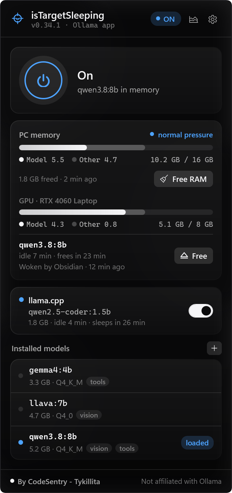
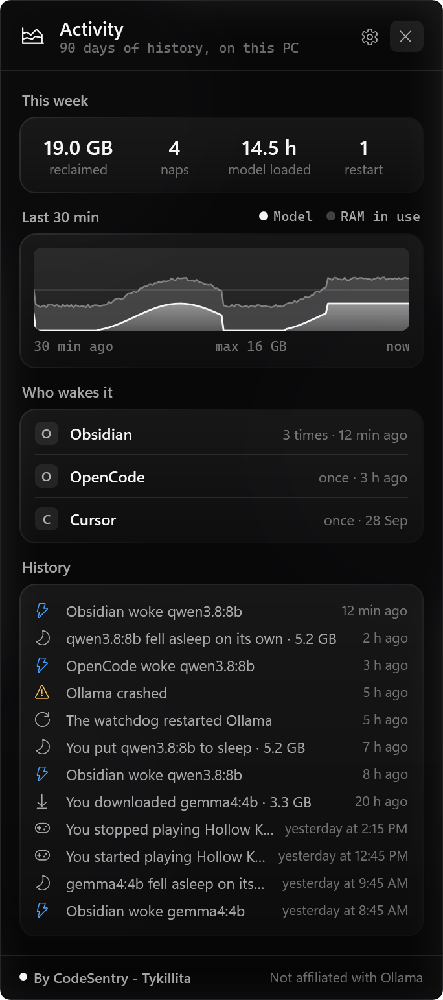
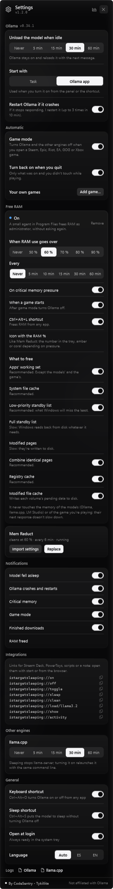

<div align="center">


# isTargetSleeping

**Watches your local models and puts them to sleep when they're idle.**

**English** · [Español](README.es.md)


[](LICENSE)

<br>

&nbsp;&nbsp;&nbsp;&nbsp;

<sub>By <b>CodeSentry - Tykillita</b></sub>

</div>

<br>

A native Windows tray app for [Ollama](https://ollama.com). It keeps an eye on your local models: when they stop
working it puts them to sleep and gives you your RAM back, and it turns Ollama on and off in one click, however it
was installed.

## Why?

A 10–30 GB local model stays in memory even when you're not using it. Turning Ollama off isn't obvious either: it
depends on how it was installed, and if you kill the wrong process, it comes right back. **isTargetSleeping** lets
the model sleep when you don't need it and gives you one-click control over Ollama, no terminal required.

## ✨ Features

| | Feature | Details |
|:-:|---|---|
| ⏻ | **Turn on and off** | The big button in the panel, or **Ctrl+Alt+O** from any app. |
| 🔍 | **Detects your install** | The Ollama app, a Windows service (NSSM, WinSW, `sc create`…), a scheduled task or a manual `ollama serve`. It stops Ollama the same way it starts. |
| 🧹 | **Frees idle memory** | After 5, 15, 30 or 60 minutes without generating, it unloads the model. Ollama stays on and reloads it with the next message. **Ctrl+Alt+S** puts it to sleep right now. |
| 🧽 | **Free RAM** | Mem Reduct's cleanup built in (working sets, file cache, standby lists…) — by button, **Ctrl+Alt+L**, over X % or every N minutes — but it never touches the models or your game. It can import and replace Mem Reduct. |
| 🎮 | **Game mode** | Open a game from Steam, Epic, Riot, EA, GOG, Rockstar or Xbox (or one you add) and Ollama turns off to give it the RAM and VRAM; quit and it comes back the same way. |
| 🛟 | **Watchdog** | If Ollama crashes or hangs, it restarts it with the same mechanism (up to 3 times in 10 minutes). |
| 🔔 | **Notifications** | Native Windows notifications when a model falls asleep, Ollama crashes, memory runs critical, a game starts or a download finishes — each one with its own switch. |
| 📊 | **PC and GPU memory** | RAM in use (same figure as Task Manager), dedicated **VRAM** of your GPU, how much of each is the model, and memory pressure. |
| 👀 | **Who wakes it** | Shows which app loaded the model (Obsidian, Cursor, a script…) from its connection to Ollama's port. |
| 📈 | **Activity** | This week: GB reclaimed, naps, hours with a model loaded, restarts; a 30-minute chart and the latest events. |
| 🗂️ | **Models** | Size, quantization and *vision* / *tools* tags. Load, **download** (with progress, cancellable) or **delete** them from the panel. |
| 🧩 | **Other engines** | A standalone **llama.cpp** `llama-server` gets its own card and idle timer; **LM Studio** is supported experimentally. |
| 🔗 | **Links** | `istargetsleeping://on`, `off`, `toggle`, `sleep`, `load/<model>`… for Stream Deck, PowerToys or scripts. |
| 🎯 | **Status at a glance** | The target in the tray, with a blue, blinking amber or no dot. |
| 🌍 | **English and Spanish** | Follows the Windows language, or pick one in Settings. |
| 🖤 | **Black glass** | Smoked black glass over Windows 11's real acrylic, translucent cards and a monochrome UI with color only for status. The tray icon follows the taskbar mode. |
| 🔒 | **Private** | Only talks to Ollama on your PC. No accounts, no telemetry, no analytics. Update checks are opt-in and off unless a release repository is configured. |
| 🧾 | **Open source** | MIT licensed. |

## 📥 Install

Downloads are on the [Releases](https://github.com/Tykillita/isTargetSleeping/releases) page.

**Portable:** download `isTargetSleeping-<version>-win-x64.zip` (or `-arm64`), unzip it anywhere and run
`isTargetSleeping.exe`. It's a single self-contained `.exe`: you don't need to install .NET.

**Installer:** `isTargetSleeping-<version>-setup-x64.exe` installs per user in
`%LOCALAPPDATA%\Programs\isTargetSleeping` (no admin).

The first time it opens its panel next to the clock and asks whether to open at login. If you can't see the icon,
it may be in the hidden icons (`^`): drag it to the taskbar, or turn it on in *Settings › Personalization ›
Taskbar › Other system tray icons*.

**Requirements:** Windows 10 (2004+) or 11 · x64 or ARM64 · [Ollama](https://ollama.com/download/windows).

## 🧭 Usage

| Action | Result |
|---|---|
| **Click** the tray icon | Opens the panel (click outside or press Esc to close it) |
| **Drag** the panel's header | Moves it; it opens there from then on. **Double-click** the header to put it back by the tray |
| **Right-click** | Turn on/off, put the model to sleep, activity, view the Ollama log, open at login, *About*, quit |
| **Ctrl+Alt+O** | Turns Ollama on or off from any app |
| **Ctrl+Alt+S** | Puts the model to sleep (and the other engines' models) without turning anything off |
| **Ctrl+Alt+L** | Frees RAM (once the memory agent is on) |
| **Click a notification** | Opens the panel |

The panel has three views: the main one, **Activity** (chart icon) and **Settings** (gear), which scroll if they
don't fit on screen.

**Settings:** *Ollama* — unload when idle, which mechanism to start it with, restart it if it crashes ·
*Automatic* — game mode, turn back on when you quit, your own games · *Notifications* — one switch per kind ·
*Integrations* — the links, ready to copy · *Other engines* — each engine's idle timer · *General* — both shortcuts,
open at login, update checks (only when configured), language · logs.

### Links

| Link | Does |
|---|---|
| `istargetsleeping://on` · `off` · `toggle` | Turns Ollama on / off / the opposite |
| `istargetsleeping://sleep` | Puts the loaded models to sleep |
| `istargetsleeping://clean` | Frees RAM |
| `istargetsleeping://load/llama3.2` | Loads a model (URL-encode names with `/`) |
| `istargetsleeping://show` · `activity` | Opens the panel / the Activity view |

They are registered per user under `HKCU\Software\Classes\istargetsleeping` (no admin) every time the app starts.
From PowerShell: `start istargetsleeping://sleep`. If the app isn't running, the link starts it.

## ⚙️ How it works

### Stopping Ollama the right way

| If Ollama comes from… | Stop | Start | Verified |
|---|---|---|:-:|
| **Ollama app** (ollama.com installer) | Asks its windows to close, ends its process tree after 2 s, then any `ollama serve` left | `ollama app.exe hidden` (tray only, no chat window — the same flag Ollama uses at login) | ✅ 0.34.1 / 0.34.4 / 0.35.0 |
| **Windows service** wrapping Ollama | Service Control Manager stop | SCM start | ⚠️ code path, not tested on real hardware |
| **Scheduled task** running `ollama serve` | Task Scheduler `Stop` | Task Scheduler `Run` | ⚠️ code path, not tested on real hardware |
| **Manual `ollama serve`** | Ends the server's process tree | Launches `ollama serve` detached, logging to `%LOCALAPPDATA%\isTargetSleeping\Logs\ollama.log` | ✅ |
| **Not installed** | — | Opens ollama.com/download | ✅ |

A service usually needs admin rights to be started or stopped: isTargetSleeping runs as a normal user and only asks
for elevation (UAC) for that one `sc start/stop`. A service's restart-on-failure policy doesn't kick in, because the
stop goes through the SCM.

Detection order: running Ollama app → running service → running task → standalone `ollama serve` → whatever is
installed. While Ollama is off, it uses the one picked in Settings or, failing that, the last one it was running
with (remembered across launches).

### Detecting an idle model

Ollama doesn't expose when the last request happened. Each loaded model runs in a runner process that only uses CPU
while it's working. On Windows the runner is `lib\ollama\llama-server.exe` (Ollama 0.34+), `ollama.exe runner` or
the older `ollama_llama_server.exe`; isTargetSleeping recognizes all three.

| Measurement (Ollama 0.34, gemma-4 E2B, RTX 4060 Laptop) | Runner CPU time |
|---|---:|
| Idle, per 2.5 s sample | +0.008 s |
| Generating a short answer | +50 s |

Every 2.5 s the app adds up the runners' CPU time (`GetProcessTimes`). If it grows by more than **0.08 s**, or the
loaded model changes, that counts as activity — and it holds even when the model runs entirely on the GPU. The logic
is in [`IdleTracker`](src/IsTargetSleeping/Core/Activity.cs), covered by tests.

### Memory

With a dedicated GPU, Ollama reports the whole model as VRAM, yet the runner still reserves gigabytes of system RAM
(CUDA host buffers, context). So the *Model* part of the bar is the runner's own private memory, read from the
process; the model line also shows how much sits on the GPU. *In use* matches Task Manager, and the total is the
installed RAM (16 GB, not the 15.7 GB usable). Pressure turns amber above 85 % load and red when Windows signals low
memory; entering *critical* sends one notification until it goes back to normal.

The **GPU** bar picks the adapter with the most dedicated memory (via DXGI, so a laptop's RTX, not the integrated
graphics) and reads `\GPU Adapter Memory(*)\Dedicated Usage` and `\GPU Process Memory(*)\Dedicated Usage` — the same
counters Task Manager uses. The runners' VRAM is the model's share. It's hidden when there's no dedicated GPU.

### Freeing RAM (instead of Mem Reduct)

| Area | How | Default |
|---|---|:-:|
| Apps' working sets | `EmptyWorkingSet` **per process**, skipping the models and the game | ✅ |
| System file cache | `NtSetSystemInformation(SystemFileCacheInformationEx)` | ✅ |
| Low-priority standby list | `SystemMemoryListInformation` → `MemoryPurgeLowPriorityStandbyList` | ✅ |
| Full standby list | → `MemoryPurgeStandbyList` (slow: Windows reads it back from disk) | ⬜ |
| Modified page list | → `MemoryFlushModifiedList` | ⬜ |
| Combine identical pages | `SystemCombinePhysicalMemoryInformation` (Windows 10+) | ✅ |
| Registry cache | `SystemRegistryReconciliationInformation` (Windows 8.1+) | ✅ |
| Modified file cache | `FlushFileBuffers` on each fixed volume | ✅ |

The defaults are Mem Reduct's (`ReductMask2 = 0xE7`); the bits are the same, so its settings import as they are.
Mem Reduct empties **every** working set at once; isTargetSleeping trims process by process and skips Ollama's
runners, `llama-server`, LM Studio and the current game — measured: the loaded model's runner kept its ~700 MB while
other apps dropped from 371 to 168 MB, and the next reply ran at full speed with no reload.

**Administrator rights, once.** These calls need admin, and isTargetSleeping runs as a normal user. *Turn on* in
Settings › Free RAM extracts a small separate console program, `isTargetSleeping.MemoryAgent.exe` (13 MB, single
file, nothing unpacked to `%TEMP%`), and runs it with UAC once: it copies itself to `C:\Program Files\isTargetSleeping\cleaner`
(only admins can write there, so the elevated task never runs code a normal process could replace) and registers the
task `\isTargetSleeping\Liberar RAM` — no triggers, highest privileges, your user only. Each cleanup starts that task
with a compact, strictly validated order as its argument (`a=e7;k=1234,5678`: areas and protected PIDs); the app
measures RAM before and after and reads the failed areas from the task's exit code. No files are written by the
elevated side. *Remove* (or the uninstaller) deletes the task and the folder.

**Rules:** over X % of RAM (it has to drop 5 points before it fires again, so a loaded model doesn't cause a loop),
every N minutes, on critical pressure, when a game starts; at least 3 minutes between automatic cleanups.

**Mem Reduct:** if it's installed, Settings shows its setup (read from `%APPDATA%\Henry++\Mem Reduct\memreduct.ini`).
*Import settings* copies its %, interval, areas and notification. *Replace* imports, closes it (through the agent: it
runs as admin), removes it from startup and turns its own auto-clean off in its ini, so the two never clean at once.
*Go back to Mem Reduct* restores its startup entry and its auto-clean.

### Watchdog

| Situation | What it sees | What it does |
|---|---|---|
| **Crash** | Ollama should be on, the API doesn't answer and no `ollama serve` is alive for 2 samples (~5 s) | Restarts it with the last mechanism |
| **Hang** | `ollama serve` is alive but the API doesn't answer for 3 samples (~7.5 s) | Kills it and restarts it |
| **You turned it off**, or quit the Ollama app from its own menu | — | Nothing |

At most 3 restarts in 10 minutes; after that it gives up, tells you, and doesn't insist until Ollama answers again.
It never acts during game mode. Measured: a killed `ollama serve` is answering again in ~8–10 s. (The Ollama app
sometimes relaunches its own server first — that's why it waits two samples.)

### Game mode

Every 2.5 s it looks for a process **with a visible window** whose `.exe` lives in a game library: Steam (every
library in `libraryfolders.vdf`), Epic (its `.item` manifests), `C:\Riot Games`, EA Games, Rockstar Games, GOG (its
registry keys), `XboxGames` on any drive, plus the games you add in Settings. Launchers, crash reporters, anti-cheat
and helpers don't count, nor does Wallpaper Engine. A game in exclusive Direct3D full screen counts too.

It enters after the game has been open for **5 s** and leaves **30 s** after you quit (so a restarting game doesn't
make Ollama flicker). On entering it turns off Ollama and the other engines that were on, remembering how; on leaving
it turns back on only those. If you turn Ollama on by hand while playing, that is respected until you quit. The panel
shows *Playing X* with **Turn on anyway** and **Not a game** (which ignores that `.exe` from then on).

### Who wakes the model

Every second the app reads Windows' TCP table (`GetExtendedTcpTable`, which includes the owning process) and notes
which processes have a connection to Ollama's port. When a model appears in memory, it's attributed to the apps seen
in the last 10 seconds, named from their `.exe` (product name, or the description for Windows' own programs) and shown
with their icon. Loads from the panel itself don't count.

### Other engines

- **llama.cpp** (tested): any `llama-server.exe` that Ollama didn't launch — Ollama's own runners are recognized by
  their parent process (`ollama.exe`) or, if the parent is gone, by the flags Ollama uses (`--no-webui --offline`).
  Port from `--port` (8080 by default), health from `/health`, the model from `/props` (Ollama blobs are shown with
  their Ollama name), activity from `/slots` plus CPU time, memory = private RAM + VRAM. llama-server can't unload
  its model without exiting, so *sleep* stops the process and remembers its exact command line; *on* relaunches it
  the same way (log in `Logs\llama-server.log`).
- **LM Studio** (**experimental, not tested on real hardware**): shown only if `lms.exe` is installed; server on port
  1234, `GET /api/v0/models` for the loaded models, `lms server start|stop` and `lms unload --all`; activity is
  measured from apps connected to its port.

### Updates

Off unless a GitHub repository (`updateRepo`, `user/repo`) is set in `settings.json`; then Settings shows *Check for
updates*. Once at start and every 24 h it reads `releases/latest`, compares versions, and looks for the same files
`package.ps1` produces: `isTargetSleeping-<version>-win-<arch>.zip` and its `.sha256`. *Update* downloads to `%TEMP%`,
checks the SHA-256, unzips, renames the running `.exe` to `.old`, puts the new one in place, relaunches and deletes
the `.old`.

## 🔒 Privacy

- It only connects to Ollama's local API (`127.0.0.1:11434`, or `OLLAMA_HOST` if set, including the user-level
  environment variable) and, for other engines, to their local ports.
- The **only** connection outside your PC is the optional update check to `api.github.com`, and only if a release
  repository is configured.
- Admin rights are used only by the memory agent, only to free RAM (and to close Mem Reduct if you replace it), and
  only after you turn it on.
- No accounts, telemetry or analytics. The only pages it opens are the ones you click: ollama.com/download and the
  credits link in *About*.
- Settings live in `%LOCALAPPDATA%\isTargetSleeping\settings.json`, the 90-day history in `stats.json` next to it and
  its own log in `Logs\app.log` (notifications, restarts, game mode). "Open at login" is the usual
  `HKCU\…\CurrentVersion\Run` entry (and it respects Task Manager's *Startup apps* switch); the links are
  `HKCU\Software\Classes\istargetsleeping`. The installer removes both.

## 🛠️ Development

100 % native Windows: C# on .NET 10 with **WPF** for the interface and **Win32** directly (P/Invoke) for everything
else — `Shell_NotifyIcon`, `RegisterHotKey`, `GlobalMemoryStatusEx`, `GetProcessTimes`, `NtQueryInformationProcess`,
the Service Control Manager, Task Scheduler (COM), DWM for the acrylic glass and rounded corners, DXGI (through its
COM method table) and PDH for the GPU, `GetExtendedTcpTable`, `SHQueryUserNotificationState` and `WM_COPYDATA` between
instances. No NuGet packages, no WinForms, no web view.

**Requirements:** .NET 10 SDK (`winget install Microsoft.DotNet.SDK.10`) · optional: Inno Setup 6 for the installer.

```powershell
.\build.ps1                    # build\isTargetSleeping.exe (self-contained, single file)
.\build.ps1 -Install           # also installs it in %LOCALAPPDATA%\Programs\isTargetSleeping and relaunches it
.\build.ps1 -Test              # tests of the pure logic (see below)
.\package.ps1                  # dist\: zip + installer for x64 and arm64, with .sha256
.\docs\generate-images.ps1     # this README's images and the logo assets
```

Set `SIGN_CERT_THUMBPRINT` before `package.ps1` to sign the `.exe` and the installer with `signtool`; unsigned
builds trigger SmartScreen.

### Command line

```powershell
$B = "$env:LOCALAPPDATA\Programs\isTargetSleeping\isTargetSleeping.exe"
& $B --status | Write-Output    # detected mechanism, whether the API responds, llama-server processes
& $B --on | Write-Output        # same path as the panel button (also --off)
& $B --sleep | Write-Output     # puts the models to sleep (through the running app if there is one)
& $B --clean | Write-Output     # frees RAM through the memory agent (same rules for protected processes)
& $B --url istargetsleeping://load/llama3.2
& $B --memory | Write-Output    # PC memory, runner CPU time and GPU memory
& $B --idle-test 20 | Write-Output   # tests auto-free with a 20 s limit
& $B --snapshot panel.png settings demo --lang en   # also: activity, game
& $B --export-logo .\out        # .ico, PNGs and SVGs from the logo geometry
```

It's a windowed app, so pipe its output (`| Write-Output`) for PowerShell to wait for it.

### Tests

`.\build.ps1 -Test` runs a small test bench (no test framework) over the pure logic: `IdleTracker`, the watchdog
(crash, hang, restart limit, manual off), `GameModeTracker` (debounce, restoring only what was on, manual override),
the `libraryfolders.vdf` and Epic manifest parsers, `ClientTracker` (10-second window), `StatsStore` aggregates and
persistence, `/api/pull` NDJSON progress, `istargetsleeping://` links, and the updater — version comparison, release
parsing, and a full download + SHA-256 check + `.exe` swap against a local HTTP server on `127.0.0.1` (nothing
leaves the PC); the memory agent's order format (it must reject anything unexpected), the cleaning rules, and the
`memreduct.ini` parser and editor.

### Project layout

```text
src/IsTargetSleeping/
├── Program.cs              Entry point, single instance, forwards links and --sleep to the running app
├── App.xaml(.cs)           Styles, tray, blinking icon, right-click menu, hotkeys
├── Cli.cs                  --status, --on, --off, --sleep, --memory, --idle-test, --snapshot, --export-logo
├── Core/
│   ├── Backend.cs          Mechanism detection (app, service, task, binary) and on/off
│   ├── OllamaApi.cs        Ollama's HTTP API, pull (NDJSON progress) and delete
│   ├── OllamaController.cs State for the interface, polling, idle auto-free, watchdog, downloads
│   ├── Supervisor.cs       Game mode, other engines, notifications, pressure, links, updates
│   ├── Supervisor.Clean.cs Freeing RAM: rules, agent, Mem Reduct
│   ├── MemoryAgent.cs      Installs and runs the memory agent (scheduled task, exit code)
│   ├── CleanSpec.cs        Cleaning areas and the agent's order format (shared with the agent)
│   ├── CleanRules.cs       When to clean automatically (pure logic)
│   ├── MemReduct.cs        Detect, import, replace and restore Mem Reduct
│   ├── Watchdog.cs         Crash and hang detection (pure logic)
│   ├── Games.cs            Game libraries, game detector and GameModeTracker
│   ├── Clients.cs          TCP connections per process, app names and ClientTracker
│   ├── Stats.cs            90-day history, weekly figures, 30-minute samples
│   ├── Gpu.cs              DXGI adapter and PDH VRAM counters
│   ├── Links.cs            istargetsleeping:// parsing and registration
│   ├── Updater.cs          GitHub releases, SHA-256 check and .exe swap
│   ├── Engines/            IEngine, llama.cpp and LM Studio (experimental)
│   ├── Activity.cs         Runner CPU time, runner memory and IdleTracker
│   ├── SystemMemory.cs     Memory in use and pressure
│   ├── Processes.cs        Processes by name, command line and parent
│   ├── Prefs.cs            Hotkeys, open at login, preferences
│   ├── Paths.cs            App identity, paths, settings store, app log
│   ├── L10n.cs             Translations (Spanish keys)
│   └── Win32.cs            Windows API calls
├── UI/
│   ├── ContentView.xaml    Main view, Activity and Settings
│   ├── PanelViewModel.cs   Everything the panel shows, computed from the state
│   ├── PanelWindow.cs      The tray flyout (the body scrolls within ~75 % of the screen)
│   ├── TrayIcon.cs         Notification-area icon, notifications, WM_COPYDATA
│   ├── Notifier.cs         Per-kind switches and the 1-per-minute limit
│   ├── Logo.cs             The target-with-a-sleeping-eye logo (icon, tray, header, SVG)
│   ├── Controls.cs         Switch, memory bar, 30-minute chart, spinner, app icons
│   ├── Theme.cs · Glass.cs · Mark.cs · AboutWindow.cs
└── Resources/Strings.en.json
src/IsTargetSleeping.Agent/    The memory agent: the only code that runs as administrator
tests/IsTargetSleeping.Tests   Tests of the pure logic
packaging/isTargetSleeping.iss Inno Setup installer
Assets/                        Icon (.ico), PNG and SVG logo
```

## Credits

**By CodeSentry - Tykillita.** CodeSentry is the software development and cybersecurity company of Ruben Pino
(Tykillita).

isTargetSleeping is based on the **idea** of [ModelNap](https://github.com/eriktaveras/modelnap) by Erik Taveras
(Taveras Solutions LLC, MIT License) — a small app that puts idle Ollama models to sleep. isTargetSleeping has been
**completely redesigned**: a native Windows app with its own identity and black-glass interface, and **new, original
features** such as game mode, the Ollama watchdog, RAM cleaning that protects the models
(replacing Mem Reduct), GPU/VRAM usage, "who wakes the model", the Activity view with its history, downloading and
deleting models, llama.cpp and LM Studio, `istargetsleeping://` links, notifications and updates. ModelNap's copyright
notice is kept in [LICENSE](LICENSE), as its MIT License requires.

Ollama is a trademark of its respective owners; this project is not affiliated with Ollama.
